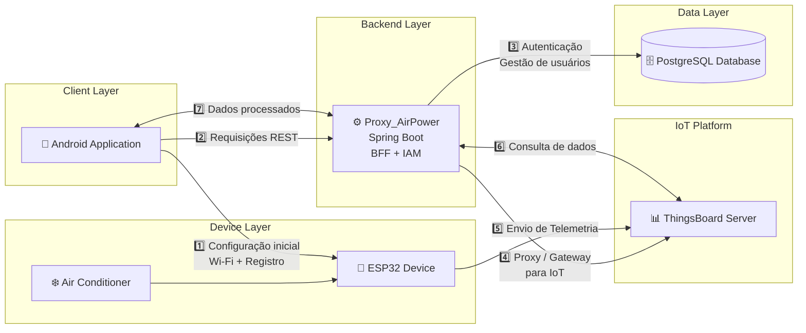

# ⚡ Proxy_AirPower


Servidor backend desenvolvido para o projeto **AirPower**, responsável por atuar como um **BFF (Backend for Frontend)** e **IAM (Identity and Access Management)** para aplicações IoT baseadas no **ThingsBoard**.

O servidor funciona como um **gateway seguro** entre os aplicativos clientes e o servidor IoT, centralizando a autenticação, o gerenciamento de usuários e o provisionamento de dispositivos.

---

# 📋 Índice

- [🏗 Arquitetura do Sistema](#-arquitetura-do-sistema)
- [✨ Funcionalidades](#-funcionalidades)
- [🚀 Tecnologias Utilizadas](#-tecnologias-utilizadas)
- [🔐 Segurança e Autenticação](#-segurança-e-autenticação)
- [🔌 Endpoints da API](#-endpoints-da-api)
- [📶 Gerenciamento de Redes Wi-Fi](#-gerenciamento-de-redes-wi-fi)
- [📂 Estrutura do Projeto](#-estrutura-do-projeto)
- [🔧 Pré-requisitos](#-pré-requisitos)
- [⚙ Instalação](#-instalação)
- [▶ Execução](#-execução)
- [👨‍💻 Autores](#-autores)

---

# 🏗 Arquitetura do Sistema

O **Proxy_AirPower** atua como um **proxy inteligente para o ThingsBoard**, abstraindo sua API e fornecendo serviços adicionais customizados.



## Cliente (Android / Web)

Responsável por:

- Interface com o usuário
- Envio de requisições HTTP REST
- Exibição de dados de dispositivos IoT
- Configuração e provisionamento de placas

## Proxy_AirPower (BFF)

Responsável por:

- Autenticação e autorização de usuários
- Gerenciamento de tenants e aplicativos
- Atuar como proxy reverso seguro para a API do ThingsBoard
- Provisionamento de dispositivos
- Gerenciamento de credenciais de redes Wi-Fi
- Criptografia avançada de senhas (**BCrypt** e **AES-128**)

## ThingsBoard

Plataforma IoT Core responsável por:

- Gerenciamento oficial de dispositivos
- Coleta de telemetria
- Construção de dashboards
- Geração de tokens JWT

## Banco de Dados (PostgreSQL)

Armazena dados exclusivos do BFF:

- Usuários e regras de negócio
- Status de acesso e datas de expiração
- Redes Wi-Fi autorizadas do laboratório
- Credenciais criptografadas de instâncias dinâmicas do ThingsBoard

---

# ✨ Funcionalidades

## 🔐 Autenticação Segura

- Cadastro de usuários via API
- Login com validação de dados locais
- Criptografia de senha via **BCrypt**
- Interceptação e gestão inteligente do **JWT do ThingsBoard**

## 🔁 Gateway Dinâmico

O servidor:

- Intercepta requisições do App Mobile
- Identifica o usuário e suas credenciais no banco
- Encaminha a requisição para o ThingsBoard correto

Permite suportar **múltiplas instâncias de ThingsBoard (multi-tenant)**.

## 👥 Gestão de Usuários (IAM)

Controle administrativo completo:

- Registro via API (status inicial **PENDING**)
- Aprovação manual por administrador
- Definição de validade de acesso
- Edição e bloqueio de usuários

Status possíveis:

- `PENDING`
- `APPROVED`
- `BANNED`
- `REJECTED`

## 📡 Provisionamento de Dispositivos

Através de rotas espelhadas:

- Criação de dispositivos
- Recuperação de tokens (**Device Credentials**)
- Gerenciamento de listagem via proxy

## 📶 Gestão de Redes Wi-Fi

Permite que os dispositivos IoT se conectem à internet:

- Cadastro manual
- Edição e remoção
- Importação em lote via CSV

As senhas são armazenadas com **criptografia AES-128 (dupla via)**.

---

# 🚀 Tecnologias Utilizadas

## Backend

- **Java 21**
- **Spring Boot 3.x**

## Frameworks & Bibliotecas

- Spring Web (REST Controllers)
- Spring Security
- Spring Data JPA
- Hibernate (ORM)
- HikariCP (Connection Pool)

## Banco de Dados

- **PostgreSQL 17**

## Criptografia

- **BCrypt** → Hash irreversível de senhas
- **AES-128** → Criptografia simétrica de credenciais

## Frontend Administrativo

- **Bootstrap 5**
- JavaScript Vanilla

## Integração IoT

- **ThingsBoard REST API**

---

# 🔐 Segurança e Autenticação

A aplicação possui **dois níveis de acesso isolados**.

## 🌐 Dashboard Web

Acesso administrativo protegido por **Spring Security (Form Login)**.

Rotas protegidas:

```
/
 /index.html
```

Credenciais padrão:

```
admin / admin123
```

---

## 📱 API Mobile

Rotas da API:

```
/api/**
```

Cabeçalhos obrigatórios:

```http
Authorization: Bearer <thingsboard_token>
X-User-Email: <user_email>
```

O email é utilizado para identificar **qual instância do ThingsBoard pertence ao usuário**.

---

# 🔌 Endpoints da API

## Autenticação

| Método | Endpoint | Descrição |
|------|------|------|
| POST | `/api/proxy/auth/login` | Autentica usuário e retorna Token TB |

### Exemplo de Payload

```json
{
  "email": "aluno@ifpe.edu.br",
  "password": "senha_app_123"
}
```

---

## 📟 Dispositivos (Proxy ThingsBoard)

| Método | Endpoint | Descrição |
|------|------|------|
| GET | `/api/proxy/tenant/devices` | Lista dispositivos |
| POST | `/api/proxy/device` | Cria novo dispositivo |
| GET | `/api/proxy/device/{deviceId}/credentials` | Obtém token da ESP32 |

---

## 🛂 Usuários

| Método | Endpoint | Descrição |
|------|------|------|
| POST | `/api/users/register` | Registra novo usuário |
| GET | `/api/users` | Lista usuários |
| PUT | `/api/users/{id}/approve` | Aprova usuário |
| PUT | `/api/users/{id}/status` | Altera status |
| PUT | `/api/users/{id}` | Edita credenciais |

---

# 📶 Gerenciamento de Redes Wi-Fi

| Método | Endpoint | Descrição |
|------|------|------|
| GET | `/api/wifi/authorized` | Lista redes |
| POST | `/api/wifi/authorized` | Adiciona rede |
| PUT | `/api/wifi/authorized/{id}` | Edita rede |
| DELETE | `/api/wifi/authorized/{id}` | Remove rede |
| POST | `/api/wifi/import` | Importa CSV |

### Exemplo de Resposta

```json
[
  {
    "id": 1,
    "ssid": "Laboratorio_IoT",
    "password": "senha_descriptografada",
    "location": "Prédio A"
  }
]
```

---

# 📂 Estrutura do Projeto

```
src/main/
 ├─ java/.../proxyairpower/
 │   ├─ config/
 │   ├─ controllers/
 │   ├─ entities/
 │   └─ repositories/
 │
 └─ resources/
     ├─ static/
     └─ application.properties
```

---

# 🔧 Pré-requisitos

- Java JDK **21**
- Maven ou Gradle
- PostgreSQL **17**
- Git
- Instância funcional do **ThingsBoard**

---

# ⚙ Instalação

Clone o repositório:

```bash
git clone https://github.com/seu-repositorio/airpower-server.git
```

Entre no diretório:

```bash
cd airpower-server
```

Configure o banco de dados em:

```
src/main/resources/application.properties
```

---

# ▶ Execução

Rodar com Maven:

```bash
mvn spring-boot:run
```

Ou gerar o JAR:

```bash
mvn package
java -jar target/airpower-server.jar
```

A API ficará disponível em:

```
http://localhost:8080
```

---

# 👨‍💻 Autores

**Davi Freitas**  
**Laboratório DEXTER / GPSERS**